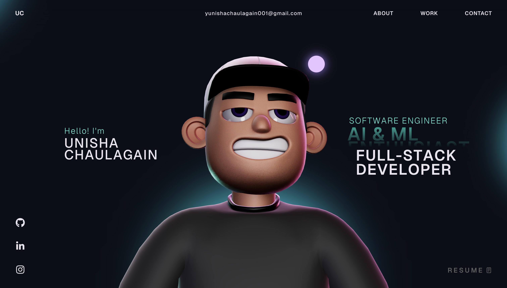

# ✨ Unisha Chaulagain — Portfolio

A modern, interactive portfolio website built with React, TypeScript, Three.js, and GSAP.



---

## 🚀 Live Demo

[unishachaulagain.com](https://unishachaulagain.com.np)

---

## 🛠️ Tech Stack

| Technology | Purpose |
|------------|---------|
| **React** | UI Framework |
| **TypeScript** | Type Safety |
| **Three.js** | 3D Character Rendering |
| **GSAP** | Smooth Animations & Scroll Effects |
| **ScrollSmoother** | Buttery Smooth Scrolling |
| **Vite** | Fast Build Tool |
| **CSS** | Custom Styling |

---

## ✨ Features

- 🎭 **Interactive 3D Character** — Follows cursor movement in real-time
- 🎞️ **Smooth Scroll Animations** — Powered by GSAP ScrollTrigger & ScrollSmoother
- 📱 **Fully Responsive** — Optimized for desktop, tablet, and mobile
- ⚡ **Fast Performance** — Built with Vite for blazing fast load times
- 🎨 **Custom Cursor** — Unique hover interactions throughout the site
- 🌙 **Modern UI/UX** — Clean, minimal design with smooth transitions

---

## 📂 Project Structure

```
unisha-portfolio/
├── public/
│   ├── draco/            # Draco decoder for 3D model compression
│   ├── images/           # Static images
│   └── models/           # 3D character model & environment
├── src/
│   ├── components/
│   │   ├── Character/    # Three.js 3D character scene
│   │   ├── Navbar.tsx    # Navigation bar
│   │   ├── HoverLinks.tsx
│   │   ├── Loading.tsx
│   │   └── styles/       # Component styles
│   ├── context/          # React context providers
│   ├── App.tsx           # Main app component
│   └── main.tsx          # Entry point
├── package.json
├── tsconfig.json
├── vite.config.ts
└── README.md
```

---

## 🏁 Getting Started

### Prerequisites

- **Node.js** >= 18.x
- **npm** >= 9.x

### Installation

```bash
# Clone the repository
git clone https://github.com/Unisha0/portfolio.git

# Navigate to the project
cd portfolio

# Install dependencies
npm install

# Start the development server
npm run dev
```

The app will be running at `http://localhost:5173`

### Build for Production

```bash
npm run build
```

### Preview Production Build

```bash
npm run preview
```

---

## 📸 Screenshots

### Landing Page
> Interactive 3D character with smooth scroll animations

### About Section
> Skills, experience, and personal introduction

### Work Section
> Featured projects with hover effects

### Contact Section
> Get in touch form and social links

---

## 📬 Contact

- **Email:** [yunishachaulagain001@gmail.com](mailto:yunishachaulagain001@gmail.com)
- **GitHub:** [@Unisha0](https://github.com/Unisha0)
- **LinkedIn:** [Unisha Chaulagain](https://linkedin.com/in/unisha-chaulagain)

---

## 📄 License

This project is licensed under the **MIT License**.

MIT License

Copyright (c) 2026 Unisha Chaulagain

Permission is hereby granted, free of charge, to any person obtaining a copy
of this software and associated documentation files (the "Software"), to deal
in the Software without restriction, including without limitation the rights
to use, copy, modify, merge, publish, distribute, sublicense, and/or sell
copies of the Software, and to permit persons to whom the Software is
furnished to do so, subject to the following conditions:

The above copyright notice and this permission notice shall be included in all
copies or substantial portions of the Software.

THE SOFTWARE IS PROVIDED "AS IS", WITHOUT WARRANTY OF ANY KIND, EXPRESS OR
IMPLIED, INCLUDING BUT NOT LIMITED TO THE WARRANTIES OF MERCHANTABILITY,
FITNESS FOR A PARTICULAR PURPOSE AND NONINFRINGEMENT. IN NO EVENT SHALL THE
AUTHORS OR COPYRIGHT HOLDERS BE LIABLE FOR ANY CLAIM, DAMAGES OR OTHER
LIABILITY, WHETHER IN AN ACTION OF CONTRACT, TORT OR OTHERWISE, ARISING FROM,
OUT OF OR IN CONNECTION WITH THE SOFTWARE OR THE USE OR OTHER DEALINGS IN THE
SOFTWARE.
