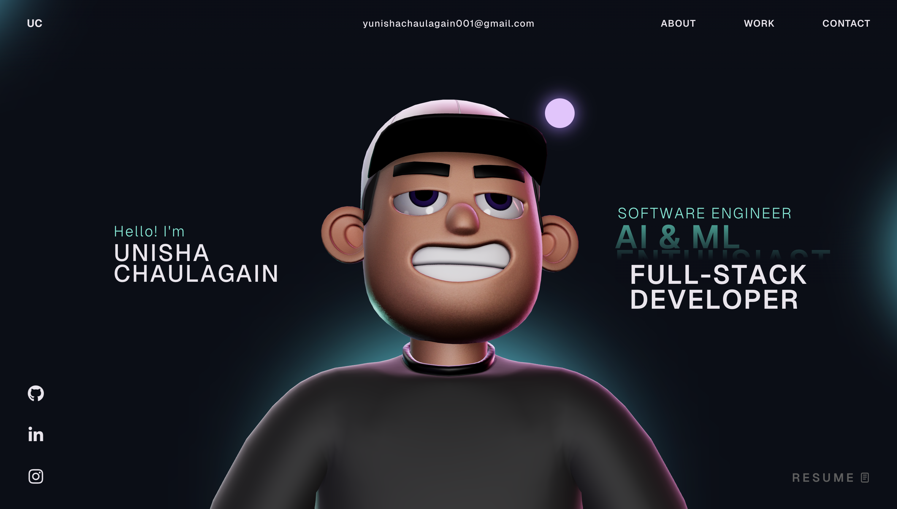

# UNISHA-PORTFOLIO

Personal portfolio website of Unisha Chaulagain.



## LIVE DEMO 
https://portfolio-one-blond-r94kxtu65r.vercel.app/

## About

Computer Engineering Student | AI & ML Enthusiast | Full-Stack Developer

This portfolio showcases my work in Django development, AI/ML applications,
and IoT-based systems. It highlights practical projects that focus on
problem-solving, real-world use cases, and user-friendly interfaces.

## Tech Stack

React, TypeScript, GSAP (ScrollSmoother, SplitText, ScrollTrigger), Three.js, HTML, CSS

## Features

- Custom animated cursor
- Smooth scroll powered by GSAP ScrollSmoother
- Split-text entrance animations
- Interactive social icons with magnetic hover effect
- Tech stack physics visualization (Three.js + Rapier)
- Responsive design

## Getting Started

```bash
npm install
npm run dev
```

## Deployment

This project is deployed on **Vercel**. To deploy your own instance:

1. Push your fork to GitHub
2. Import the repository on [vercel.com](https://vercel.com)
3. Vercel will auto-detect the Vite + React setup and deploy

No additional configuration is needed — Vercel handles the build automatically.


## Featured Projects

- Smart Health Emergency Assistance
- Fine-tuned GPT-2 RAG
- AI Training With 10 Projects
- Civic Connect
- Tour Booking System

## Skills

- Languages: Python, JavaScript, TypeScript, C, C++
- Frameworks/Tools: Django, React, Streamlit, TensorFlow, PyTorch, Git, GitHub
- Interests: Artificial Intelligence, Machine Learning, Computer Vision,
  Full-Stack Web Development

## Social Links

- GitHub: https://github.com/Unisha0
- LinkedIn: https://www.linkedin.com/in/unisha-chaulagain/
- Instagram: https://www.instagram.com/partofyune_sha/

## License

This project is open source and available under the [MIT License](LICENSE).
